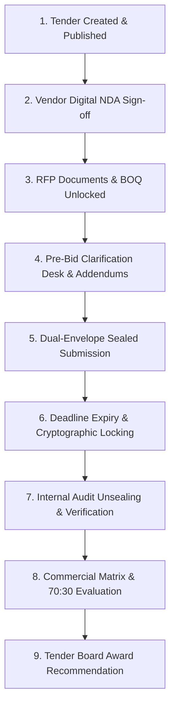

# BID NEXT — Media Prima eTender Intelligence Platform

[](https://react.dev/)
[](https://www.typescriptlang.org/)
[](https://vitejs.dev/)
[](https://tailwindcss.com/)
[](https://www.iso.org/isoiec-27001-information-security.html)
[](#two-envelope-sealed-bidding-protocol)

**BID NEXT** is an enterprise-grade, audit-compliant digital eTender and procurement intelligence platform engineered for **Media Prima Berhad**. It governs the end-to-end procurement lifecycle: from RFP specification authoring and legal NDA gatekeeping, to dual-envelope cryptographic bid submissions, tamper-proof audit clearance, automated commercial evaluation matrices, and tender board award recommendations.

---

## Table of Contents

- [Executive Summary](#executive-summary)
- [Core Capabilities](#core-capabilities)
  - [1. Two-Envelope Sealed Bidding Protocol](#1-two-envelope-sealed-bidding-protocol)
  - [2. Cryptographic Audit & Tamper-Proof Verification](#2-cryptographic-audit--tamper-proof-verification)
  - [3. Digital NDA Sign-Off & Access Control](#3-digital-nda-sign-off--access-control)
  - [4. Commercial Matrix & Scoring Engine](#4-commercial-matrix--scoring-engine)
  - [5. Pre-Bid Clarification Desk & Addendums](#5-pre-bid-clarification-desk--addendums)
  - [6. Multi-Persona Role Simulation](#6-multi-persona-role-simulation)
  - [7. Export & Executive Dossier Generation](#7-export--executive-dossier-generation)
- [Procurement Workflow Lifecycle](#procurement-workflow-lifecycle)
- [Tech Stack](#tech-stack)
- [Project Directory Structure](#project-directory-structure)
- [Getting Started](#getting-started)
  - [Prerequisites](#prerequisites)
  - [Installation](#installation)
  - [Environment Setup](#environment-setup)
  - [Running the Development Server](#running-the-development-server)
  - [Production Build](#production-build)
- [Regulatory & Compliance Alignment](#regulatory--compliance-alignment)
- [Contributing & License](#contributing--license)

---

## Executive Summary

Traditional procurement operations face risks of premature pricing leaks, disputed submission integrity, lack of audit trails, and slow manual commercial comparisons. 

**BID NEXT** solves these challenges by implementing:
- **Blind Technical Evaluations**: Commercial pricing is cryptographically locked until Group Internal Audit independently verifies statutory qualifications and technical compliance.
- **SHA-256 Tamper Evident Fingerprinting**: Every submitted bid generates a verifiable cryptographic checksum at submission time.
- **Real-Time BOQ & Capex Variance Intelligence**: Instant calculations of itemized Bill of Quantities (BOQ), 6% SST, Capex variances, and weighted 70:30 technical/commercial scores.

---

## Core Capabilities

### 1. Two-Envelope Sealed Bidding Protocol
- **Envelope A (Technical & Statutory)**:
  - SSM (Suruhanjaya Syarikat Malaysia) company registration verification.
  - CIDB (Construction Industry Development Board) grade validation (G1–G7) and MOF registration compliance.
  - Technical methodology, executive CVs, track records, and SLA documentation.
- **Envelope B (Commercial & Pricing)**:
  - Interactive Bill of Quantities (BOQ) price input with unit-cost calculations.
  - Real-time statutory 6% Malaysian Sales and Service Tax (SST) computation.
  - Fixed-price validity agreement.
  - Instant submission receipt with SHA-256 digital fingerprint and timestamp.

### 2. Cryptographic Audit & Tamper-Proof Verification
- Managed by **Group Internal Audit** & **Governance Officers**.
- Independent verification step that unlocks Envelope B only after Envelope A meets mandatory technical thresholds.
- Audit timeline logging every critical action (NDA sign-off, tender document download, bid submission, addendum issuance, committee evaluation) with immutable hash tokens.

### 3. Digital NDA Sign-Off & Access Control
- Vendors cannot view or download confidential RFP blueprints, architectural drawings, or technical specifications without completing a legally binding digital Non-Disclosure Agreement (NDA).
- Captures full legal signatory name, NRIC/Passport identification number, timestamp, and client IP address.

### 4. Commercial Matrix & Scoring Engine
- Dynamic comparative matrix benchmarking all verified bids against the approved Capex budget.
- Automatic calculation of:
  - Capex budget variance (percentage & absolute MYR value).
  - Technical score (max 70%) based on specs, track record, and SLA terms.
  - Commercial score (max 30%) with normalized inverse pricing algorithms.
  - Combined composite score (100-point scale).
- Automated identification of **Rank 1 (Lowest Compliant Proposal)** and committee award recommendations.

### 5. Pre-Bid Clarification Desk & Addendums
- Structured vendor inquiry channel categorized into Technical, BOQ/Commercial, Legal, and Submission queries.
- Designated Subject Matter Expert (SME) responder assignment.
- Publication of official binding addendums and circular directives distributed to all participating bidders simultaneously to ensure fairness.

### 6. Multi-Persona Role Simulation
Switch between enterprise roles at any time to test the complete procurement workflow:
- 🏢 **Vendor / Bidder** (`Syarikat ABC Sdn Bhd`, `Omega Media Systems`, etc.) — Sign NDAs, review RFPs, submit dual-envelope bids.
- 📋 **Procurement Admin** (`Media Prima Group Procurement`) — Publish tenders, dispatch invitations, evaluate commercial matrices, recommend awards.
- 🛡️ **Governance & Audit** (`Group Internal Audit - Ir. Daniel Wong`) — Verify submissions, inspect SHA-256 checksums, authorize commercial unsealing.
- 💼 **Internal Requester** (`Engineering / Broadcast Operations`) — Submit Tender Requisition Forms (TRF) and respond to technical clarifications.

### 7. Export & Executive Dossier Generation
- **Spreadsheet Export**: One-click download of the complete commercial comparison matrix as a CSV formatted for Microsoft Excel.
- **Tender Board Evaluation Report**: Clean, high-resolution printable evaluation dossier featuring committee signatures, compliance summaries, and budget variance analyses.

---

## Procurement Workflow Lifecycle



---

## Tech Stack

| Layer | Technologies |
|---|---|
| **Frontend Framework** | [React 19](https://react.dev/) + [TypeScript 5](https://www.typescriptlang.org/) |
| **Bundler & Tooling** | [Vite 8](https://vitejs.dev/) + [tsx](https://github.com/privatenumber/tsx) |
| **Styling & Design System** | [Tailwind CSS v4](https://tailwindcss.com/) + Media Prima Design System Tokens |
| **Icons & Typography** | [Lucide React](https://lucide.dev/), [Phosphor Icons](https://phosphoricons.com/), Inter, JetBrains Mono |
| **Animation & Micro-interactions** | [Motion](https://motion.dev/) (Framer Motion v12) |
| **Server & Middleware** | [Express 4](https://expressjs.com/) with Vite middleware integration |
| **Cryptography & Integrity** | Web Crypto SHA-256 client-side hashing algorithms |

---

## Project Directory Structure

```text
.
├── .env.example                     # Environment variable blueprint
├── index.html                       # Application shell with font and icon loaders
├── metadata.json                    # AI Studio applet capabilities and metadata
├── package.json                     # Project dependencies and script definitions
├── tsconfig.json                    # TypeScript compiler configuration
├── vite.config.ts                   # Vite configuration with Tailwind CSS v4
│
└── src/
    ├── main.tsx                     # React DOM entry point
    ├── App.tsx                      # Root application layout, navigation & modal containers
    ├── index.css                    # Tailwind CSS v4 imports, brand tokens & typography
    │
    ├── context/
    │   └── TenderContext.tsx        # Centralized state management for tenders, bids, audits & roles
    │
    ├── types/
    │   └── tender.ts                # TypeScript domain models (Tenders, Bids, BOQ, Audit, Roles)
    │
    ├── data/
    │   └── mockData.ts              # Seed data for Media Prima tenders, registered bidders, and audits
    │
    ├── utils/
    │   └── exportUtils.ts           # CSV matrix export and printable PDF evaluation dossier generators
    │
    ├── components/
    │   ├── Header.tsx               # Top navigation bar, tender selector, and role indicator
    │   ├── Footer.tsx               # Compliance footer and quick navigation links
    │   ├── RoleSwitcherModal.tsx    # Multi-persona switcher (Vendor, Procurement, Audit, Requester)
    │   ├── AuditTrailModal.tsx      # Immutable cryptographic audit log viewer
    │   ├── CommercialMatrixModal.tsx# Modal wrapper for commercial evaluation
    │   ├── TitanMatrixModal.tsx     # Fullscreen deep-dive comparison matrix
    │   ├── NdaModal.tsx             # Interactive digital NDA agreement sign-off
    │   ├── PdfViewerModal.tsx       # Confidential document previewer
    │   ├── TenderProcessStepper.tsx # Visual indicator for the 6-stage procurement lifecycle
    │   ├── TrfDrawer.tsx            # Tender Requisition Form drawer for departments
    │   ├── QaDrawer.tsx             # Pre-bid inquiry response drawer
    │   ├── ReqQaDrawer.tsx          # Requester-side clarification management drawer
    │   ├── InvitationDispatchModal.tsx # Vendor invitation management
    │   └── GlobalToast.tsx          # Toast notification provider
    │
    └── views/
        ├── ActiveTendersView.tsx    # Published tenders catalog, status badges & RFP access
        ├── VendorSubmissionView.tsx # Two-Envelope technical & commercial sealed bidding form
        ├── GovernanceAuditView.tsx  # Audit verification, checksum checks & commercial unsealing
        ├── CommercialMatrixView.tsx # Automated comparative scoring & Capex variance analytics
        ├── ClarificationDeskView.tsx# Pre-bid circulars, SME assignment & vendor Q&A
        ├── CreateTenderView.tsx     # Wizard for publishing new tenders & defining BOQ line items
        └── RequesterView.tsx        # Internal department requisition portal
```

---

## Getting Started

### Prerequisites
- **Node.js**: `v18.0.0` or higher (Node 20+ recommended)
- **Package Manager**: `npm`, `yarn`, or `pnpm`

### Installation

1. Clone the repository:
   ```bash
   git clone https://github.com/your-org/bid-next-etender.git
   cd bid-next-etender
   ```

2. Install dependencies:
   ```bash
   npm install
   ```

### Environment Setup

Create a local `.env` file from `.env.example`:
```bash
cp .env.example .env
```

| Variable | Description |
|---|---|
| `GEMINI_API_KEY` | *(Optional)* Used for intelligent RFP parsing and automated addendum synthesis |
| `APP_URL` | Application root URL for callbacks and report linking (Default: `http://localhost:3000`) |

### Running the Development Server

Start the local Vite development server:
```bash
npm run dev
```
The application will be accessible at: **`http://localhost:3000`**

### Production Build

To build the optimized static assets for production deployment:
```bash
npm run build
```

To preview the production build locally:
```bash
npm run preview
```

To run type checking and linting:
```bash
npm run lint
```

---

## Regulatory & Compliance Alignment

BID NEXT is tailored specifically to Malaysian statutory and enterprise procurement governance frameworks:
- **SSM Registration**: Mandatory corporate validation for all bidders.
- **CIDB Grading Scale**: Enforcement of CIDB classifications (Grade G1 through G7) based on project capex limits.
- **MOF Registered Categories**: Support for Ministry of Finance contractor credentials.
- **SST (Sales & Service Tax)**: Automated calculation of the standard 6% Malaysian service tax on all commercial lines.
- **ISO 27001 & Two-Envelope Integrity**: Cryptographic blind unsealing guarantees that commercial proposals cannot be viewed prior to the official close of the technical audit phase.

---

## Contributing & License

Designed and developed for **Media Prima Berhad**. All rights reserved. 
For internal inquiries, contact the **Group Procurement & Internal Audit Division**.
